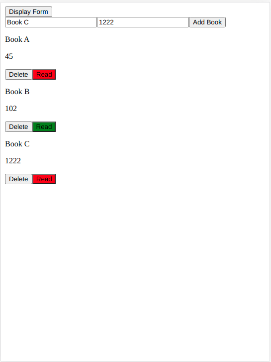

# Library JS Project

> This project features a list of items that can be added through a form, which can be hidden by a button.
A 'Read' button will show Red if the book is marked 'not read', and green if marked 'read'.

## Built With

HTML5
JavaScript

## Getting Started

- Clone the repo locally
- Open it in your favorite IDE
- Start the project in a live server
### Repo

The repo is available in [this link](https://rokovarano.github.io/BookApp/).

### Prerequisites

Requires Javascript and a web browser
### Usage

Click the 'Display Form' button to show or hide the form.
Complete the form and click 'Add Book' to add an element to the list.
Click 'Delete' to remove the element from the list.
Click 'Read' to alternate between Red and Green colors, representing the 'read' status.
## Authors

👤 **Rodrigo Ibaceta**

- GitHub: [Rodrigo Ibateca](https://github.com/RokoVarano/)
- Twitter: [@Rodrigo](https://twitter.com/RodrigoIbacet11)
- LinkedIn: [LinkedIn](https://www.linkedin.com/in/rodrigo-ibaceta-a8657611a/)

👤 **Emanuel Okello**

- GitHub: [oxenprogrammer](https://github.com/oxenprogrammer)
- Twitter: [@ox_emmy](https://twitter.com/ox_emmy)
- LinkedIn: [Emanuel Okello](https://www.linkedin.com/in/emanuel-okello/)

## 🤝 Contributing

Contributions, issues, and feature requests are welcome!

Feel free to check the [issues page](https://github.com/RokoVarano/BookApp/issues).

## Show your support

Give a ⭐️ if you like this project!

## Acknowledgments

- Hat tip to anyone whose code was used
- Inspiration
- etc

## 📝 License

This project is [MIT](LICENSE.md) licensed.